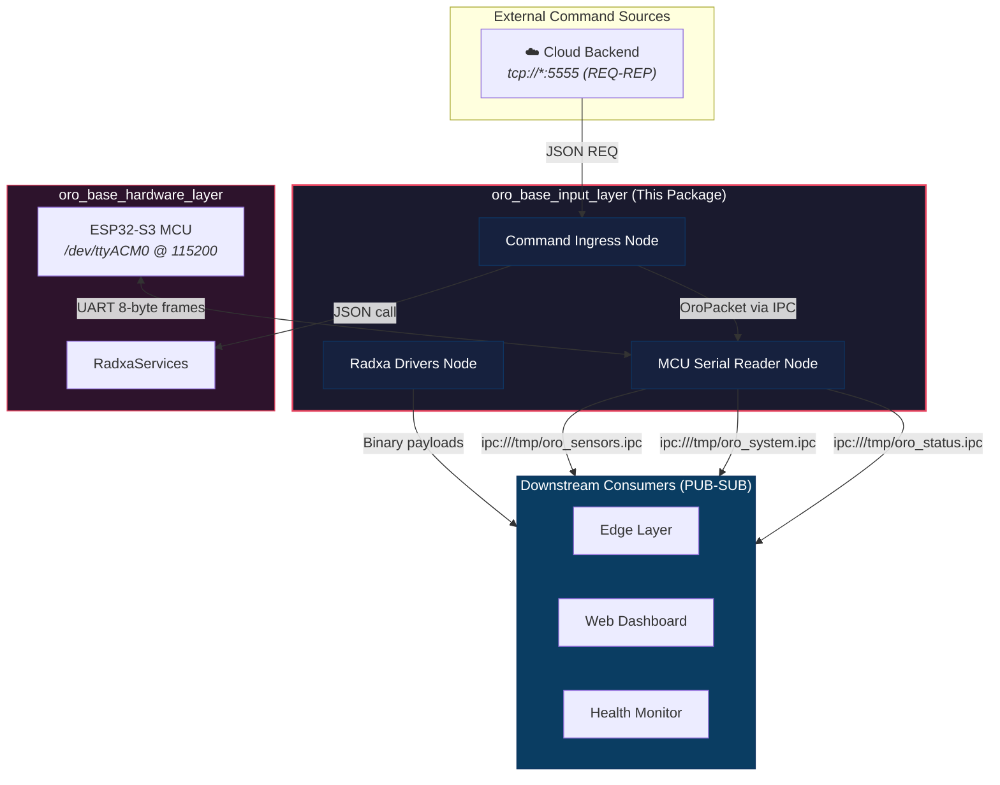
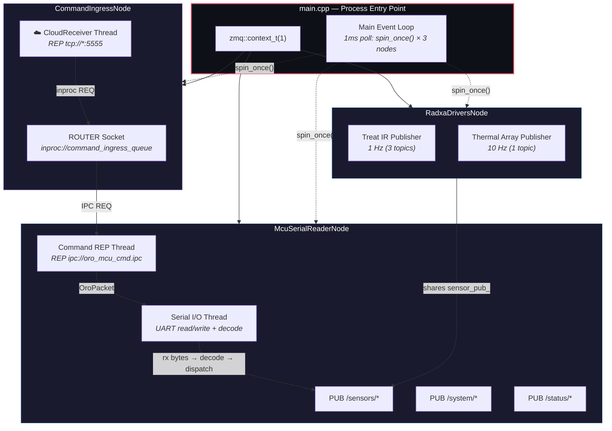
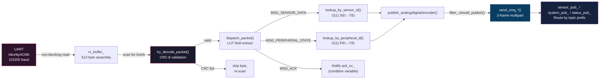
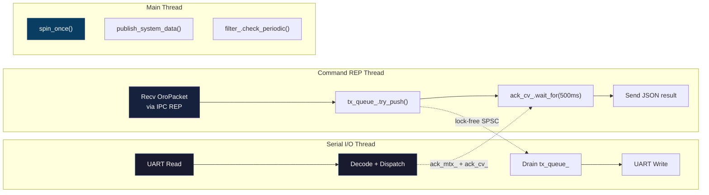
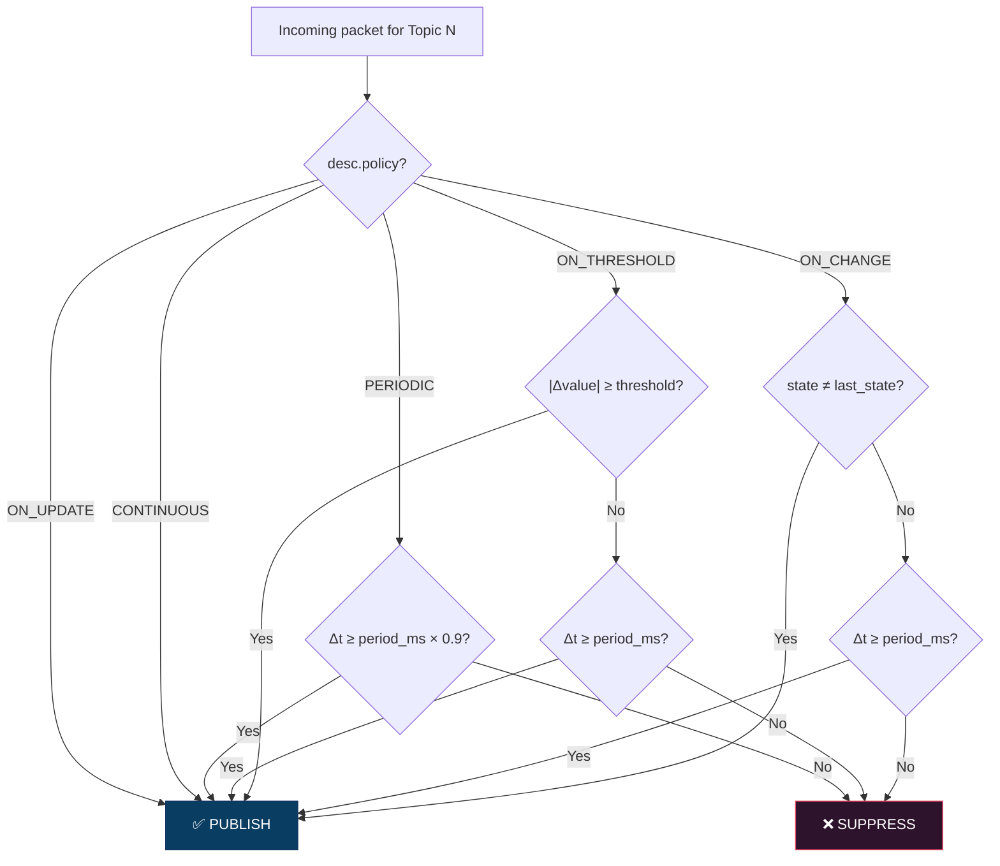
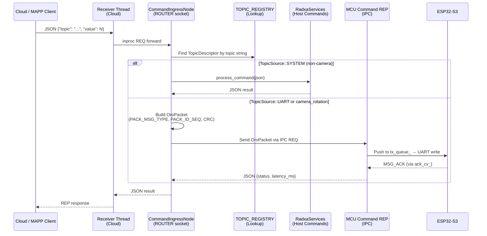
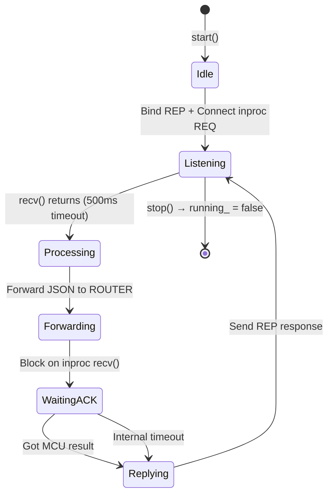
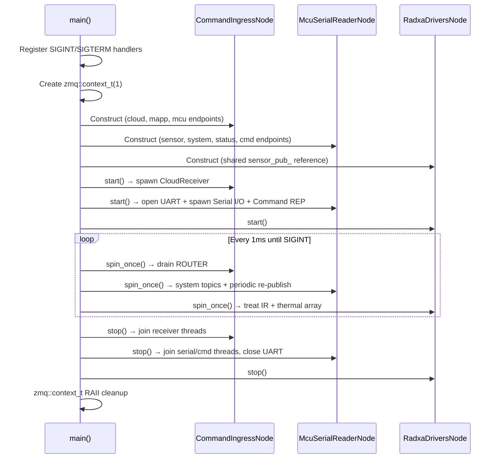
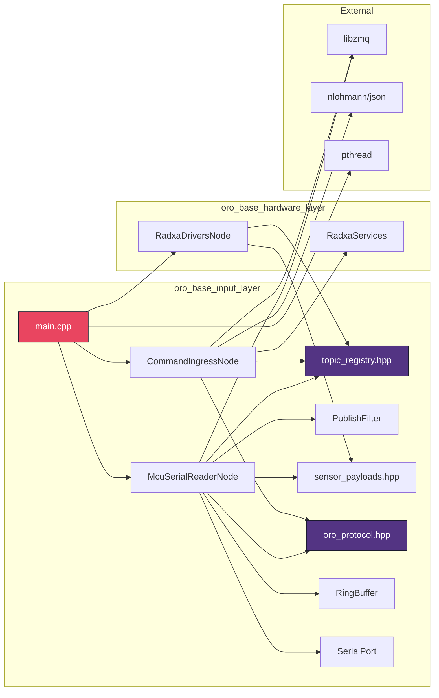

# `oro_base_input_layer` — Package Documentation

> **Scope**: Multi-threaded UART/ZMQ middleware that bridges MCU telemetry and external commands into a unified publish-subscribe data bus for the ORo Base platform.

---

## L0 — System Context

The Input Layer is the **central nervous system** of the ORo Base stack. It sits between the physical hardware (MCU + Host sensors) and all upstream consumers (Edge Layer, Web Dashboard, Health Monitor). Every byte of sensor data and every command flows through this node.



### What This Package Does

| Responsibility | How |
|:---|:---|
| Ingest MCU telemetry | Read 8-byte `OroPacket` from UART, validate CRC, decode, and publish |
| Publish host-generated data | System clock, WiFi connectivity state |
| Accept external commands | Cloud (`:5555`) via ZMQ REQ-REP |
| Route commands to hardware | MCU-bound → binary OroPacket; Host-bound → `RadxaServices` JSON |
| Filter publish noise | Per-topic policies: ON_CHANGE, ON_THRESHOLD, PERIODIC, CONTINUOUS |
| Drive Radxa-native sensors | Thermal IR array (10 Hz) and treat dispenser IR sensors (1 Hz) |

### ZMQ Endpoint Map

| Endpoint | Socket Type | Direction | Data |
|:---|:---|:---|:---|
| `ipc:///tmp/oro_sensors.ipc` | PUB | Outbound | `/sensors/*` topics |
| `ipc:///tmp/oro_system.ipc` | PUB | Outbound | `/system/*` topics |
| `ipc:///tmp/oro_status.ipc` | PUB | Outbound | `/status/*` topics |
| `ipc:///tmp/oro_mcu_cmd.ipc` | REP | Internal | MCU command forwarding |
| `tcp://*:5555` | REP | Inbound | Cloud commands |
| `inproc://command_ingress_queue` | ROUTER-REQ | Internal | Command aggregation |

---

## L1 — Package Architecture

The Input Layer runs as a **single process with 4 threads**, orchestrated from `main.cpp`. Three logical nodes share one ZMQ context and cooperate through lock-free queues and inproc sockets.



### Thread Ownership Matrix

| Thread | Owner | Responsibility | Hot Path? |
|:---|:---|:---|:---|
| **Main thread** | `main.cpp` | `spin_once()` on all 3 nodes: periodic publishes, system topics, command routing | Yes |
| **Serial I/O** | `McuSerialReaderNode` | Non-blocking UART read → decode → CRC → dispatch → ZMQ PUB; drain tx_queue → UART write | Yes |
| **Command REP** | `McuSerialReaderNode` | Accept `OroPacket` via IPC → push to tx_queue → wait for ACK (500ms timeout) | No |
| **Cloud Receiver** | `CommandIngressNode` | Accept JSON on tcp:5555 → forward to ROUTER → relay MCU result back | No |

### Directory Layout

```
oro_base_input_layer/
├── CMakeLists.txt                          ← Builds input_layer_node executable
├── include/
│   ├── command/
│   │   ├── cloud_receiver_thread.hpp       ← Cloud REQ-REP receiver
│   │   └── command_ingress_node.hpp        ← Command aggregation + routing
│   └── data/
│       ├── oro_protocol.hpp                ← Host-side OroPacket (mirrors firmware)
│       ├── topic_registry.hpp              ← 36-topic compile-time routing table
│       ├── sensor_payloads.hpp             ← Binary payload structs (Analog/Digital/Encoder/Thermal)
│       ├── mcu_serial_reader_node.hpp      ← UART-to-ZMQ middleware node
│       ├── publish_filter.hpp              ← Per-topic publish policy engine
│       ├── serial_port.hpp                 ← POSIX serial port RAII wrapper
│       └── ring_buffer.hpp                 ← Lock-free SPSC ring buffer
├── src/
│   ├── main.cpp                            ← Process entry point, node orchestration
│   ├── command/
│   │   ├── cloud_receiver_thread.cpp       ← REP listener + inproc forwarding
│   │   └── command_ingress_node.cpp        ← JSON parse → topic lookup → route
│   └── data/
│       ├── mcu_serial_reader_node.cpp      ← Full UART → ZMQ pipeline
│       ├── publish_filter.cpp              ← Policy evaluation logic
│       └── serial_port.cpp                 ← termios 8N1 raw mode config
└── build/
```

### Build Target

| Target | Type | Dependencies |
|:---|:---|:---|
| `input_layer_node` | Executable | `libzmq`, `pthread`, `libradxa_drivers.so`, `nlohmann/json` |

---

## L2 — Component Deep-Dive

### 2.1 McuSerialReaderNode — The Data Pipeline

The core data path that transforms raw UART bytes into typed ZMQ messages. This is the highest-throughput component in the system.

#### Pipeline Stages



#### Decode Algorithm (`try_decode_packet`)

1. **Scan** `rx_buffer_` for `START_BYTE (0xAA)`, discard preceding garbage
2. **Check** if ≥ 8 bytes available after start byte
3. **Copy** candidate 8-byte frame into `OroPacket`
4. **Validate** CRC-8 over bytes 1–6
5. On CRC failure → skip one byte, re-scan (desync recovery)
6. On success → consume 8 bytes, increment `packets_ok_`

#### Inter-Thread Communication



| Mechanism | Direction | Type | Hot Path? |
|:---|:---|:---|:---|
| `rx_queue_` | Serial → Main | `RingBuffer<uint8_t, 2048>` SPSC | ~~Unused~~ (decode moved to serial thread) |
| `tx_queue_` | CMD REP → Serial | `RingBuffer<OroPacket, 32>` SPSC | Yes |
| `ack_mtx_` + `ack_cv_` | Serial → CMD REP | `mutex` + `condition_variable` | Infrequent (command ACKs only) |

#### ZMQ Socket Routing

The node maintains **3 separate PUB sockets**, routed by topic string prefix:

| Prefix | Socket | IPC Endpoint |
|:---|:---|:---|
| `/sensors/*` | `sensor_pub_` | `ipc:///tmp/oro_sensors.ipc` |
| `/system/*` | `system_pub_` | `ipc:///tmp/oro_system.ipc` |
| `/status/*` | `status_pub_` | `ipc:///tmp/oro_status.ipc` |

#### Host-Generated System Topics

Published from `spin_once()` on the main thread (no UART involvement):

| Topic | Source | Policy | Rate |
|:---|:---|:---|:---|
| `/system/time/clock` | `steady_clock::now()` | PERIODIC | 1s |
| `/system/connectivity/state` | `/sys/class/net/wl*/operstate` | ON_CHANGE | 30s fallback |

#### Diagnostic Counters

| Counter | Meaning |
|:---|:---|
| `packets_ok_` | Successfully decoded and dispatched packets |
| `packets_crc_fail_` | Packets dropped due to CRC-8 mismatch |
| `packets_invalid_id_` | Valid CRC but unmapped SID/PID |

---

### 2.2 Topic Registry — The Routing Brain

A **compile-time constexpr lookup table** of 36 topic descriptors. Zero runtime cost, zero heap allocation. This is the single source of truth for all data routing decisions.

#### Topic Descriptor Schema

```cpp
struct TopicDescriptor {
    uint8_t       topic_id;    // Index into TOPIC_REGISTRY[N]
    TopicCategory category;    // ANALOG | DIGITAL | ENCODER | THERMAL
    PublishPolicy policy;      // ON_CHANGE | ON_THRESHOLD | PERIODIC | CONTINUOUS | ON_UPDATE
    TopicSource   source;      // UART (from MCU) | SYSTEM (host-generated)
    const char*   zmq_topic;   // ZMQ Frame 0 topic string
    float         threshold;   // Delta for ON_THRESHOLD (0.0 if N/A)
    uint32_t      period_ms;   // Interval for PERIODIC / fallback (0 if N/A)
    int8_t        sensor_id;   // Mapped SID/PID for UART (-1 if SYSTEM)
};
```

#### Complete Topic Map

| TID | ZMQ Topic | Category | Policy | Source | Threshold | Period |
|:---|:---|:---|:---|:---|:---|:---|
| 0 | `/sensors/food_weight/bowl_1` | ANALOG | ON_THRESHOLD | UART | 1.0 | 5s |
| 1 | `/sensors/food_weight/bowl_2` | ANALOG | ON_THRESHOLD | UART | 1.0 | 5s |
| 2 | `/sensors/water_level/tank` | ANALOG | ON_THRESHOLD | UART | 0.5 | 5s |
| 3 | `/sensors/water_level/bowl` | ANALOG | ON_THRESHOLD | UART | 0.5 | 3s |
| 4 | `/sensors/environment/humidity` | ANALOG | ON_THRESHOLD | UART | 0.5 | 10s |
| 5 | `/sensors/environment/temperature` | ANALOG | ON_THRESHOLD | UART | 0.1 | 10s |
| 6 | `/sensors/camera_rotation/limit_switch_1` | DIGITAL | ON_CHANGE | UART | — | 10s |
| 7 | `/sensors/camera_rotation/limit_switch_2` | DIGITAL | ON_CHANGE | UART | — | 10s |
| 8 | `/sensors/camera_rotation/optical_encoder` | ENCODER | CONTINUOUS | UART | — | — |
| 9 | `/sensors/camera_rotation/home` | DIGITAL | ON_CHANGE | UART | — | — |
| 10 | `/system/power/switch` | DIGITAL | ON_CHANGE | UART | — | — |
| 11 | `/system/power/battery_level` | ANALOG | ON_THRESHOLD | UART | 1.0 | 60s |
| 12 | `/system/time/clock` | ANALOG | PERIODIC | SYSTEM | — | 1s |
| 13 | `/system/device/heartbeat` | DIGITAL | PERIODIC | UART | — | 10s |
| 14 | `/system/connectivity/state` | DIGITAL | ON_CHANGE | SYSTEM | — | 30s |
| 15–16 | `/status/lid/{1,2}` | DIGITAL | ON_CHANGE | UART | — | — |
| 17 | `/status/water_pump` | DIGITAL | ON_CHANGE | UART | — | — |
| 18 | `/status/camera_rotation/stepper_motor` | DIGITAL | ON_CHANGE | UART | — | — |
| 19 | `/status/display/seven_segment` | ANALOG | ON_UPDATE | UART | — | — |
| 20 | `/status/led_indicator` | ANALOG | ON_UPDATE | UART | — | — |
| 21–30 | `/commands/*` | ANALOG | ON_UPDATE | SYSTEM | — | — |
| 31–33 | `/sensors/treat/*` | DIGITAL | ON_CHANGE | SYSTEM | — | 1s |
| 34 | `/sensors/thermal/ir_array` | THERMAL | PERIODIC | SYSTEM | — | 100ms |

#### Lookup Performance

| Function | Lookup | Cost |
|:---|:---|:---|
| `lookup_by_topic_id(tid)` | Direct array index | O(1), zero branches |
| `lookup_by_sensor_id(sid)` | Static `SID_TO_TID[16]` LUT | O(1), one indirection |
| `lookup_by_peripheral_id(pid)` | Static `PID_TO_TID[16]` LUT | O(1), one indirection |

---

### 2.3 Publish Filter — Noise Suppression Engine

Stateful filter that enforces per-topic publish policies. Prevents redundant ZMQ publishes by tracking last-known values and timestamps for each of the 36 topics.

#### Policy Decision Matrix



#### Per-Topic State Cache

```cpp
struct TopicState {
    float    last_analog_value;     // Last published analog reading
    uint8_t  last_digital_state;    // Last published digital state (0xFF = never)
    int32_t  last_encoder_ticks;    // Last published encoder count
    uint64_t last_publish_time_ms;  // Epoch ms of last publish
    bool     ever_published;        // True after first publish
};
```

#### Periodic Fallback Re-Publish

The `check_periodic()` method is called from `spin_once()` and scans all 36 topics. For any topic where `Δt ≥ 1.5 × period_ms`, it triggers a re-publish using the **last cached value** — ensuring downstream consumers always have fresh data even if the upstream sensor goes silent.

---

### 2.4 CommandIngressNode — The Command Router

Aggregates external commands from multiple sources and routes them to the appropriate executor.

#### Command Flow Architecture



#### Topic-Based Routing Logic

1. **Parse** incoming JSON for `topic` and `value` fields
2. **Scan** `TOPIC_REGISTRY` for matching `zmq_topic` string
3. **Route** based on `TopicSource`:
   - `SYSTEM` → `RadxaServices::process_command()` (JSON in, JSON out)
   - `UART` or `camera_rotation` → Build `OroPacket`, send via IPC to MCU command REP thread
4. **Reply** JSON result back through the ROUTER → REQ → REP chain to the original client

#### Sequence Number Management

- `cmd_seq_` is a 4-bit rolling counter (0–15) maintained by `CommandIngressNode`
- Each outgoing `MSG_COMMAND` packet carries the current `cmd_seq_`, then increments
- The MCU echoes the same `seq` in its `MSG_ACK`, enabling correlation

---

### 2.5 Receiver Threads — Cloud

Initially separate threads, each runs a ZMQ REP socket on a dedicated TCP port and forwards commands to the `CommandIngressNode` via an inproc REQ socket. Currently only Cloud receiver is implemented.

#### Thread Lifecycle



| Parameter | CloudReceiver |
|:---|:---|
| TCP endpoint | `tcp://*:5555` |
| Internal endpoint | `inproc://command_ingress_queue` |
| Recv timeout | 500ms |
| Thread join | On `stop()` call |

> **Design Note**: The ROUTER socket uses ZMQ identity frames to demultiplex responses back to the correct originating thread.

---

### 2.6 Sensor Payloads — Binary Wire Format

All ZMQ messages use **packed binary structs** with no JSON overhead. Every payload carries a common `MsgHeader` for traceability.

#### Common Header (10 bytes)

```
┌──────────┬──────────┬──────────────────┐
│ sensor_id│ seq_num  │  timestamp_ms    │
│ 1B       │ 1B       │ 8B (uint64)      │
└──────────┴──────────┴──────────────────┘
```

#### Payload Types

| Struct | Size | Fields | Used For |
|:---|:---|:---|:---|
| `AnalogPayload` | 14B | `header` + `float value` | Weight, water level, temp, humidity, battery |
| `DigitalPayload` | 11B | `header` + `uint8_t state` | Switches, heartbeat, connectivity, lid, pump |
| `EncoderPayload` | 14B | `header` + `int32_t ticks` | Camera encoder tick count |
| `ThermalPayload` | 286B | `header` + `amg_frame_t` | 8×8 thermal IR array frame |

#### Thermal Frame Detail (`amg_frame_t`, 276 bytes)

| Field | Type | Size | Description |
|:---|:---|:---|:---|
| `timestamp_ms` | `uint32_t` | 4B | Monotonic clock |
| `ambient_temp` | `float` | 4B | Thermistor reading °C |
| `pixels[64]` | `float[64]` | 256B | 8×8 array, row-major, °C |
| `min_temp` | `float` | 4B | Frame minimum |
| `max_temp` | `float` | 4B | Frame maximum |
| `overflow` | `uint8_t` | 1B | Sensor overflow flag |
| `_pad[3]` | `uint8_t[3]` | 3B | Alignment padding |

---

### 2.7 Ring Buffer — Lock-Free SPSC Queue

Template-based single-producer, single-consumer ring buffer used for inter-thread communication on the hot path.

#### Design Properties

| Property | Detail |
|:---|:---|
| **Lock-free** | Uses `std::atomic` with acquire/release ordering — no mutexes |
| **Power-of-2 capacity** | Enables `mask = N-1` modular arithmetic (no division) |
| **Cache-line aligned** | `head_`, `tail_`, `buffer_` on separate 64-byte cache lines |
| **Trivially copyable** | `static_assert` enforces `std::is_trivially_copyable_v<T>` |
| **Bulk operations** | `push_bulk()` / `pop_bulk()` handle wrap-around in ≤ 2 memcpy calls |

#### Instantiations

| Instance | Template | Usage |
|:---|:---|:---|
| `rx_queue_` | `RingBuffer<uint8_t, 2048>` | Reserved for future use (decode moved to serial thread) |
| `tx_queue_` | `RingBuffer<OroPacket, 32>` | CMD REP → Serial I/O: outgoing command packets |

---

### 2.8 Serial Port — POSIX UART Wrapper

RAII wrapper for `/dev/ttyACM0` with termios configuration.

#### Configuration

| Parameter | Value |
|:---|:---|
| Baud rate | 115200 (configurable) |
| Data bits | 8 |
| Parity | None |
| Stop bits | 1 |
| Flow control | None (no HW or SW flow control) |
| Mode | Raw (no canonical processing) |
| Read | Non-blocking (`VMIN=0, VTIME=0`) |
| Write | Blocking |

---

## Process Lifecycle



---

## Cross-Package Dependencies


